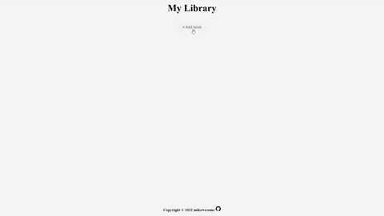

# My Library

## Links
- Live Site URL: [My Library](https://mikowesome.github.io/library/)

## Project Screenshot

## Project Description

- Project is a library web app that lets you store books you or plan to read like a normal library.

- Project shows the ability to use object constructors and use the data, store in an array or manipulate the object.

- Project demonstrates a high level of skill in manipulating the DOM using innerHTML, textContent, classList etc.

- Project exhibit the ability of using local storage to store data and to retrieve data from it.  

## Functions Covered

- Object Constructor
- querySelector()
- addEventListener()
- classList
- splice()
- push()
- forEach()
- textContent
- innerHTML
- appendChild()
- createElement()
- preventDefault()
- localStorage.setItem()
- localStorage.getItem()
- JSON.parse()
- JSON.stringify()